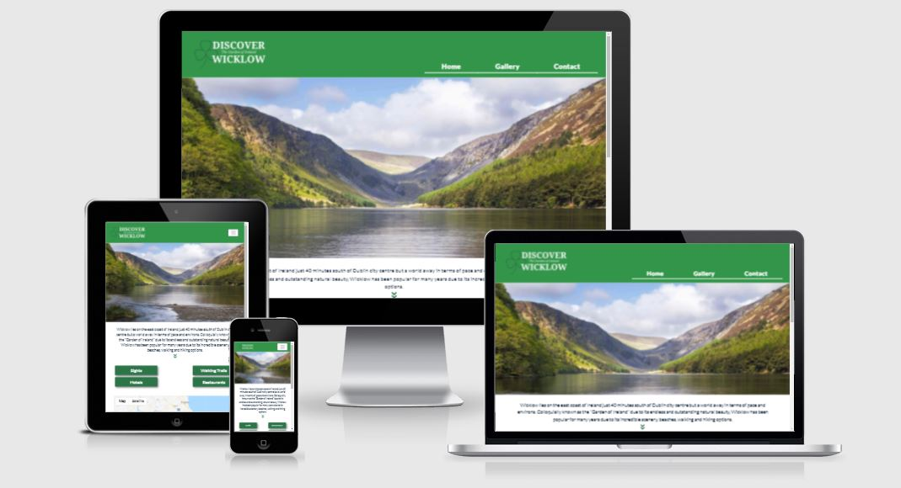
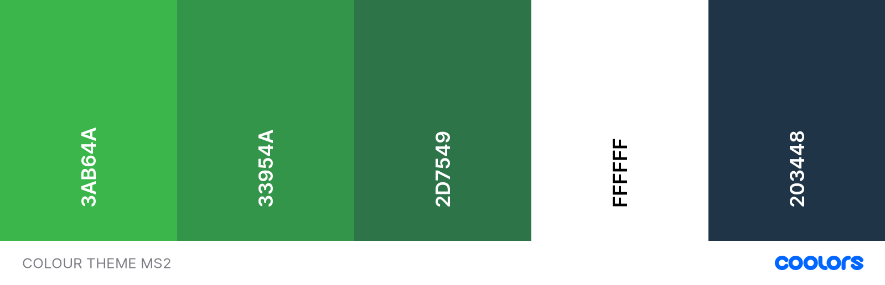

[View Discover Wicklow website here](https://tony-reddington.github.io/discover-wicklow/)

# Discover Wicklow


## The goal of this website is to target both International and National travelers and influence them to travel to the Co.Wicklow region. The website provides a map with markers, showing various areas of interest such as sights, walking trails, Hotels and Restaurants allowing users to find information in one place and providing links/phone numbers for each recommendation to make it easier for them to research and plan their trip. The website also shows images of the Wicklow region in a gallery and a contact page for users to ask for further information.

### User Experience (UX)

#### The user goals will be to:
* Research information in the Wicklow region for their next trip.
* View marker information by clicking buttons.
* Find brief overview and website for each map marker where available.
* View selection of photography for travel inspiration with text showing where each image was taken.
* Contact the website owner for further travel information and guidance.

### User Stories

#### As a user, i want - 
* the navigation bar clearly visible so i can easily navigate the website.
* the website responsive across devices so i can swap and change devices as i please and still see the website clearly.
* the page laid out neatly so that i can find information effortlessly.
* all sights, walking trail, hotel and restaurant information provided on a map so i can plan my trip based on my available travel time.
* contact information available for each map marker recommendation so i can plan my trip.
* to see images of the Wicklow area to help inspire and identify where i want to travel in the region.
* a website contact page so i can make contact with the website owner to ask further questions.

### Site owner goals

#### As the site site owner, i want - 
* to influence the user to travel and spend money in the Wicklow region by providing recommendations.
* to provide them with Sight/Walking tour/ Hotel and Restaurant information as markers on a map. 
* provide an infowindow for each map marker giving the user a brief overview of the location with website information where available allowing the user to do further research.
* to provide an image gallery of Wicklow and help the user choose which areas they want to visit.
* the user to have a contact page where they can contact me through the website and ask questions about any category not covered on the map or ask any miscellaneous questions.

### Design

#### Colour Scheme
 - The colours used across the website are Greens to represent Wicklow in Ireland, White for simplicity and Navy for the font colour on the White background rather than plain Black because it makes the text stand out on the screen.


#### Typography
 - The font used across the website is Lato because its simple and easy to read with sans serif as the fall back font.

#### Imagery
 - The imagery used scross the website all represent Wicklow. The main image on the home page is of Glendalough and is the most popular sight visited in Wicklow. Further popular Wicklow tourist location imagery appears on the Gallery page showing what Wicklow has to offer. The Contact page has a background image featuring Shamrocks representing Ireland adding some flare to the page.  
#### Wireframes

* [Home wireframe](assets/wireframes/home.pdf)

* [Gallery wireframe](assets/wireframes/gallery.pdf)

* [Contact wireframe](assets/wireframes/contact-us.pdf)

## Features

### Existing Features
 * The website is made of of three pages that are connected by a responsive navigation bar in the header section with the company logo appearing on the left. The navigation bar changes to a hamburger button on smaller screen sizes. A footer appears at the bottom of each page containing the address/ clickable phone number and social links.
 * #### Home page
   * The landing page image shows users the most popular site in Wicklow and show them what Wicklow has to offer.
   * There is limited text about Wicklow that will slide down once the user clicks the down arrow button beneath the text.
   * Buttons controls the markers on the map and when the markers are clicked am info window opens showing the user some brief information and a website if available.
 * #### Gallery page
   * The Gallery features 9 x images of the most popular location in Wicklow to inspire the user and help them choose where to travel in Wicklow.
   * When each image is clicked, the responsive fancybox is activivated enlarging the image showing the site name allowing the user to click left or right through the images.
 * #### Contact page
   * The Gallery page has tect tellign the user to contact us for further info.
   * A form is centred on the page that required all info to be filled and on submit will send the info thorugh email.js to my email.
   * On clicking send the user will receive a response beneath the button to let them know if the message was sent successfully or if the message failed to send.
   * The page also features a background image of Shamrocks to represent Ireland and give the page some character.
### Features for future implimentation
 * Images for each infowindow
 * Map directions from current location to each marker location
## Technology Used

### Languages used
* [HTML5](https://en.wikipedia.org/wiki/HTML5)
* [CSS3](https://en.wikipedia.org/wiki/CSS)
* [Javascript](https://en.wikipedia.org/wiki/JavaScript)


### Frameworks/Libraries and Programs used
1.  [Balsamiq](https://balsamiq.com/)
    - Balsamic was used to build wireframes for the 3 x website pages.
2.  [Font Awesome](https://fontawesome.com/)
    - Font awesome was used for the social media icons in the footer.
3.  [Google fonts](https://fonts.google.com/)
    - The Lato font that i used across the website was taken from Google fonts.
4.  [Istockphoto](https://www.istockphoto.com/)
    - Istockphoto was used for all the website images.
5.  [TinyJPG](https://tinyjpg.com/)
    - Tinyjpg was used to reduce the size of all the website images.
6.  [Befunky photo editor](https://www.befunky.com/)
    - Befunky photo editor was used to crop and resize images.
7.  [Bootstrap](https://getbootstrap.com/)
    - Bootstrap was used for the navbar and to make my website more responsive across different size devices.
8.  [Coolers](https://coolors.co/)
    - Coolers was used to help generate a colour palette for the entire site.
9.  [Fancybox](http://fancybox.net/home)
    - Fancybox tool was used to display images when enlarged.
10. [Google Maps API](https://developers.google.com/maps)
    - The Google Maps API was used to hold all the map markers and info windows for each travel location.
11. [EmailJS](https://www.emailjs.com/)
    - EmailJS was used to connect the submitted form to my email service.
12. [Favicon](https://favicon.io/)
    - Favicon.io was used to create the website favicons.
13. [JQuery](https://jquery.com/)
    - JQuery was used to add interactivity across the website.

## Testing

* [Jigsaw CSS validator](https://jigsaw.w3.org/css-validator/) - [Results](assets/images/css-results.JPG)
* [W3C Markup validator](https://validator.w3.org/) - [Home page results](assets/images/home-results.JPG) - [Gallery page results](assets/images/gallery-results.JPG) - [Contact page results](assets/images/contact-results.JPG)
* [JSHint](https://jshint.com/) - I passed both main.js and sendEmail.js through JSHint and both results showed no errors.

### Testing user Stories
-   #### User Goals
1. Research information in the Wicklow region for their next trip.
    * The website displays text providing information about Wicklow, a map showing all the relevant locations and images to help them choose whre to travel. 
2. View marker information by clicking buttons.
    * The markers drop on to the map when the map when the buttons are clicked.
3. Find brief overview and website for each map marker where available.
    * When each marker is clicked, an info window appears and displays location information and a website if one is available.
4. View selection of photography for travel inspiration with text showing where each image was taken.
    * Nine images are displayed on the gallery page with locational information available when the image is clicked and enlarged.
5. Contact the website owner for further travel information and guidance.
    * The contact page provides a form allowing the user to contact the owner.

-   #### User Stories
    ##### As a user, i want - 
1. the navigation bar clearly visible so i can easily navigate the website.
    * The navigation bar is repsonsive across all devices and is in clear view at the top right hand side of the page.
2. the website responsive across devices so i can swap and change devices as i please and still see the website clearly.
    * The website is fully responsive across all screen sizes.
3. the page laid out neatly so that i can find information effortlessly.
    * The website is seperated over three pages making it east to find everything.
4. all sights, walking trail, hotel and restaurant information provided on a map so i can plan my trip based on my available travel time.
    * All sights, walking trail, hotel and restaurant information is displayed on the map when the button controls are clicked.
5. contact information available for each map marker recommendation so i can plan my trip.
    * When the map marker is clicked an info window is displayed providing a website where available. 
6. to see images of the Wicklow area to help inspire and identify where i want to travel in the region.
    * Nine images are available on the gallery page with identifier text when clicked and enlarged.
7. a website contact page so i can make contact with the website owner to ask further questions.
    * A contact form is available on the contact page for asking questions.

-   #### Site Owner Goals
    ##### As the site site owner, i want - 
1. to influence the user to travel and spend money in the Wicklow region by providing recommendations.
    * The user is provided with images, text about Wicklow and an abundance of travel information through map marker info windows.
2. to provide them with Sight/Walking tour/ Hotel and Restaurant information as markers on a map. 
    * Map markers appear on the map when the buttons are clicked.
3. provide an infowindow for each map marker giving the user a brief overview of the location with website information where available allowing the user to do further research.
    * An infowindow is visible when each map markers is clicked. Each infowindow contains the location name, a brief overview about the location and a website where available.
4. to provide an image gallery of Wicklow and help the user choose which areas they want to visit.
    * Nine images are available with the gallery page.
5. the user to have a contact page where they can contact me through the website and ask questions about any category not covered on the map or ask any miscellaneous questions.
    * The user can make contact using the form on the contact page.


### Further Testing
 * The website was tested on Chrome, Safar and Firefox with no issues found.
 * Google Dev tools were used in the creation of the website and to ensure each page was responsive across all device screen sizes.
 * Google dev lighthouse was used to test the performance/ accessibility/ best practice and SEO and all return a high score.

## Deployment

### Github Pages

The website was deployed to github pages following the steps below -

1. Login to github pages and locate the [Discover Wicklow](https://github.com/tony-reddington/discover-wicklow)
2. At the top of the repository page you must locate the settings button.
3. Scroll down the page until you find the "Github pages" section then click "Check it out here!".
4. Under "Source", click the dropdown called "None", select "Master Branch" and click save.
5. The page will automatically refresh.
6. The now published site [link](https://tony-reddington.github.io/discover-wicklow/) will appear above "Source".

### Forking the GitHub Repository

By forking the GitHub Repository we make a copy of the original repository on our GitHub account to view and/or make changes without affecting the original repository by using the following steps...

1. Log in to GitHub and locate the [Discover Wicklow](https://github.com/tony-reddington/discover-wicklow)
2. At the top right of the Repository just below the navigation bar, locate the "Fork" Button.
3. You should now have a copy of the original repository in your GitHub account.

### Making a Local Clone

1. Log in to GitHub and locate the [Discover Wicklow](https://github.com/tony-reddington/discover-wicklow)
2. Under the repository name, click "Clone or download".
3. To clone the repository using HTTPS, under "Clone with HTTPS", copy the link.
4. Open Git Bash
5. Change the current working directory to the location where you want the cloned directory to be made.
6. Type `git clone`, and then paste the URL you copied in Step 3.

```
$ git clone https://github.com/tony-reddington/discover-wicklow
```

7. Press Enter. Your local clone will be created.

```
$ git clone https://github.com/tony-reddington/discover-wicklow
> Cloning into `CI-Clone`...
> remote: Counting objects: 10, done.
> remote: Compressing objects: 100% (8/8), done.
> remove: Total 10 (delta 1), reused 10 (delta 1)
> Unpacking objects: 100% (10/10), done.
```

Click [Here](https://help.github.com/en/github/creating-cloning-and-archiving-repositories/cloning-a-repository#cloning-a-repository-to-github-desktop) to retrieve pictures for some of the buttons and more detailed explanations of the above process.

### Replacing Google maps API key

1. Replace the star text below with you Google Maps API key - 
```HTML5
<script
    src="https://maps.googleapis.com/maps/api/js?key=*******************************&callback=initMap&libraries=&v=weekly"
    async>
</script>
```
2. Paste your updated script text that now incluse your API key over the existing script on index.html from line 104 to line 106.

## Credits

### Code
* Bootstrap was used for the navbar and to add responsiveness to parts of the website.
* [W3 Schools](https://www.w3schools.com/) & [Stack overflow](https://stackoverflow.com/) were used to help find tips and solutions.

### Content
* All text throughout the website was written by the developer.

### Media
* All images were downloaded from [Istock](https://www.istockphoto.com/) with credit to WoutervandenBroek, RobinsonBecquart, trabantos, Pablo Escuder Cano, yykkaa, Roman Overko, Dawid Kalisinski Photography, eldarsverdlov, espiegle, Aitormmfoto & MNStudio.
* The company logo was created using [Canva](https://www.canva.com/).
### Acknowledgements
* My mentor Medale Oluwafemi who gave pointers and feedback.
* Family and friends for testing the website across multiple devices.